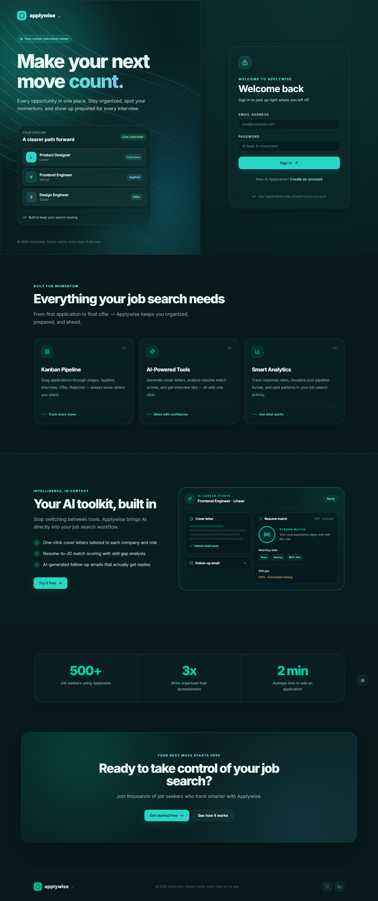
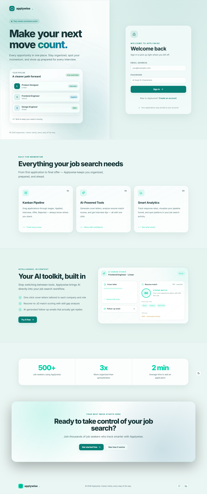
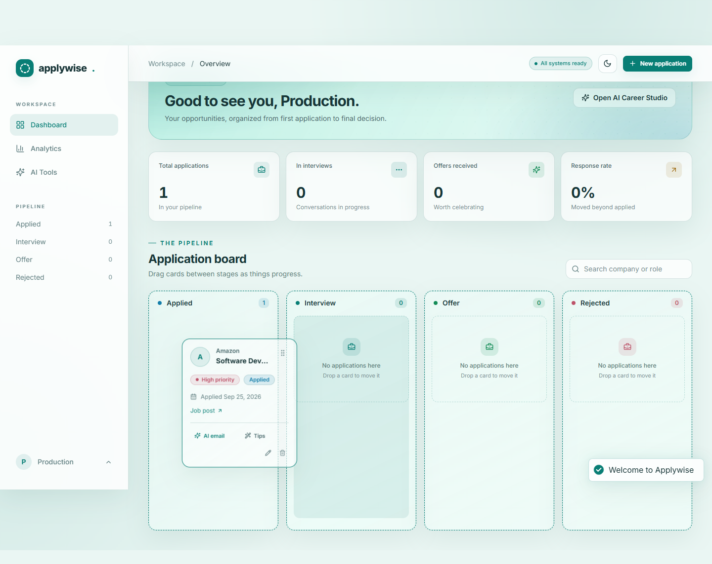
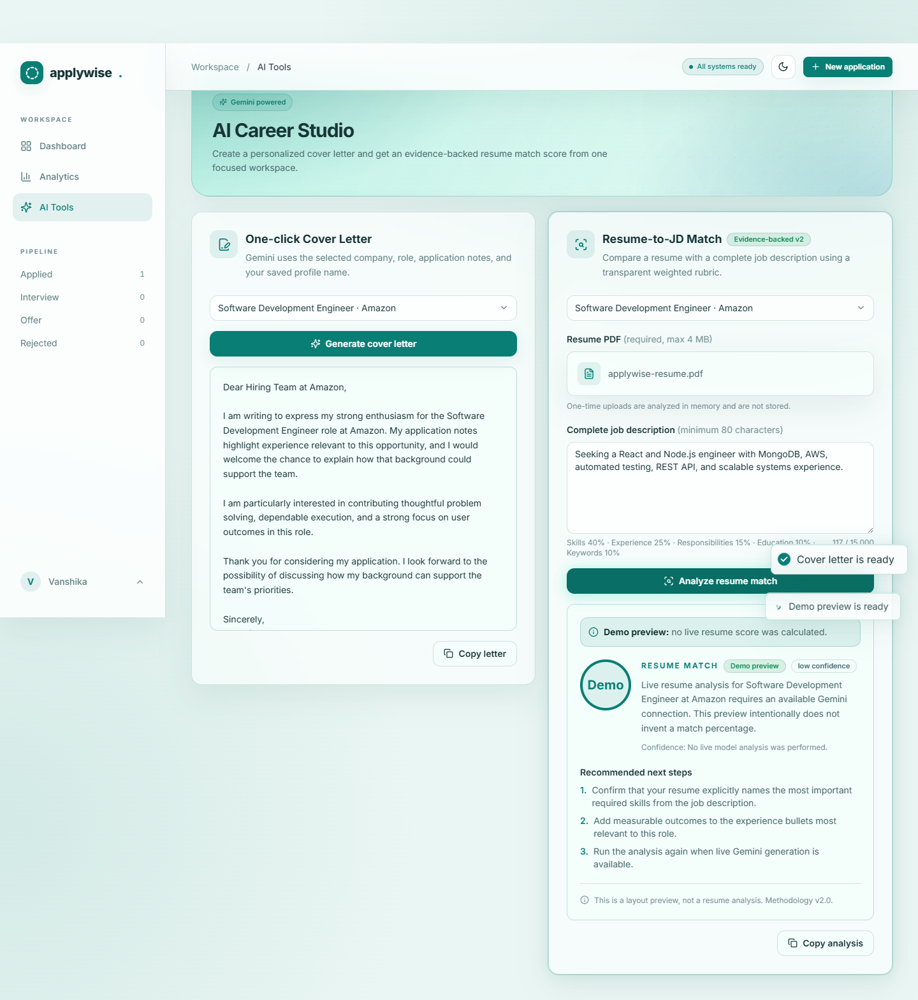
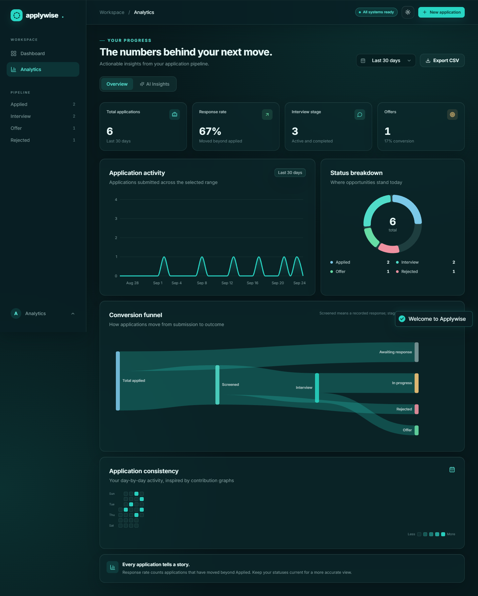

# Applywise

A job application tracker with a Kanban pipeline, AI career assistance, analytics, private resume uploads, and live status notifications.

Live app and API: [applywise-flax.vercel.app](https://applywise-flax.vercel.app). Vercel serves the Vite client and the Express REST API from the same origin.

The interface uses teal glass panels and supports synchronized day and night modes across the landing page and authenticated workspace. Its public landing page includes an animated product feature grid, AI workflow preview, scroll-triggered proof metrics, and focused conversion CTA. The dedicated AI Career Studio at `/ai-tools` keeps Cover Letter and Resume Match workflows easy to find outside the Kanban cards. The sign-in hero uses Aceternity UI's Background Beams, recolored to match the theme. The global theme preference is stored in the browser and restored before React renders.

## Product tour

### Premium landing experience



### Synchronized light theme



### Kanban pipeline with drag feedback



### AI Career Studio



### Actionable analytics



## Stack

- Client: React 19, Vite, Tailwind CSS 4, shadcn/ui components, Framer Motion, Recharts, `@hello-pangea/dnd`, Socket.io client
- API: Node.js, Express 5, MongoDB aggregation pipelines with Mongoose, Redis, BullMQ, JWT, bcrypt, LangChain with Google Gemini, AWS S3 via `multer-s3`, MongoDB GridFS fallback storage, Socket.io
- Local containers: Docker Compose with MongoDB, Redis, API, BullMQ AI worker, and Vite client
- Production: Vercel for the Vite client and Express API, MongoDB Atlas for persistent data
- Alternative API host: Render configuration is included in `render.yaml`

## Quick start

Requires Node.js 22+ and pnpm 10+. For local development without Docker, start a MongoDB instance first.

```bash
cd applywise
pnpm install
cp server/.env.example server/.env
cp client/.env.example client/.env
pnpm dev
```

If MongoDB and Docker are not installed, use `pnpm dev:local` instead. On its first run, this development-only command downloads a MongoDB binary and starts it with data stored in `server/.local/db`. The local JWT secret is generated in `server/.local/jwt-secret`. Resume PDFs are stored privately in `server/.local/resumes` unless an S3 bucket is configured. These files are ignored by Git. `pnpm dev:local` starts the client and API together; no `.env` files are required for local resume uploads. For live Follow-up, Tips, Cover Letter, and Resume Match responses, add `GEMINI_API_KEY=your-key` to `server/.env` and restart `pnpm dev:local`. Without a key, these actions show clearly labeled example output for local demos.

Edit `server/.env` before starting: set a random `JWT_SECRET` with at least 32 characters and a reachable `MONGODB_URI`. The client is at `http://localhost:5173`; the API is at `http://localhost:4000/api`.

For Docker, set a Gemini API key in an untracked `.env` in this folder if you want live AI features, then run:

```bash
docker compose up --build
```

The Compose file supplies local MongoDB and Redis services plus a development JWT secret. Redis caches each user's analytics response for five minutes and backs the BullMQ AI queue. Application mutations invalidate that user's cache version. Compose runs a separate AI worker with bounded concurrency and retry backoff. It stores resume PDFs in a persistent Docker volume for development and enables labeled AI previews by default. To stream uploads directly to private S3 objects, set `RESUME_STORAGE=s3` and the AWS variables in `.env`. To use live AI, set `GEMINI_API_KEY` in `.env`; a configured key always takes precedence over previews. Set your own `JWT_SECRET` for anything beyond local development.

## Environment variables

| Variable | Purpose |
| --- | --- |
| `MONGODB_URI` | MongoDB connection string |
| `REDIS_URL` | Optional Redis connection URL for the five-minute analytics cache; Docker Compose configures this automatically |
| `AI_WORKER_CONCURRENCY` | Parallel BullMQ AI jobs per worker; defaults to `4` |
| `AI_WORKER_RATE_LIMIT` | Maximum AI jobs started per worker per minute; defaults to `20` |
| `JWT_SECRET` | JWT signing key, at least 32 characters |
| `CLIENT_ORIGIN` | Exact client origin allowed by CORS and Socket.io; comma separated for multiple origins |
| `GEMINI_API_KEY` | Google AI Studio credential for follow-up emails, interview tips, cover letters, resume matching, and analytics insights |
| `GEMINI_MODEL` | Gemini model; defaults to `gemini-3.5-flash-lite` |
| `AI_DEMO_MODE` | `true` enables clearly labeled preview output when the configured AI provider is unavailable |
| `AWS_REGION`, `AWS_S3_BUCKET` | Private S3 bucket location |
| `AWS_ACCESS_KEY_ID`, `AWS_SECRET_ACCESS_KEY` | Optional locally; use IAM role credentials in AWS when possible |
| `RESUME_STORAGE` | Optional override: `local` for development files or `s3` for AWS S3; without S3, production uses private MongoDB GridFS |
| `VITE_API_URL` | Optional separate API origin for the Vite client, without `/api`; omit for the same-origin Vercel deployment |
| `VITE_SOCKET_URL` | Optional persistent Socket.io service origin for production live events |

Without a Gemini key, `dev:local` and Docker Compose return labeled example output for AI actions. Resume Match previews intentionally return no percentage because a demo must not look like a real analysis. Local development resume and profile photo uploads stay in the ignored `server/.local` folder. In production, configured S3 credentials store private files with AES-256 server-side encryption; without S3, resumes use private MongoDB GridFS and profile photos use protected MongoDB binary storage behind signed URLs. S3 credentials need `s3:PutObject`, `s3:GetObject`, and `s3:DeleteObject` on the `resumes/` and `profile-photos/` prefixes. Profile photos accept JPG, PNG, or WebP files up to 2 MB. The email notification switch stores a preference in MongoDB; outbound email delivery is not part of this project.

## Deployment

The current production deployment uses the root `vercel.json`. It builds `client/dist`, exposes Express through `api/index.js`, and rewrites `/api/*` to that function. MongoDB Atlas is connected through the Vercel Marketplace and supplies `MONGODB_URI`.

1. Import this repository into Vercel with `applywise` as the project root, or deploy from that directory with `vercel --prod`.
2. Connect MongoDB Atlas and set `JWT_SECRET` plus `CLIENT_ORIGIN` in Vercel project environment variables.
3. Add `GEMINI_API_KEY` from Google AI Studio for live Follow-up, Tips, Cover Letter, Resume Match, and LangChain career insight generation. `GEMINI_MODEL` defaults to the low-latency model `gemini-3.5-flash-lite`.
4. Add a managed Redis connection as `REDIS_URL` to enable the five-minute production analytics cache. The API remains available without Redis and reports a cache bypass.
5. Optionally create a private S3 bucket and add `AWS_REGION`, `AWS_S3_BUCKET`, `AWS_ACCESS_KEY_ID`, and `AWS_SECRET_ACCESS_KEY`. When omitted, production uploads remain functional through MongoDB storage.
6. Redeploy after changing environment variables.

The application saves accounts, profile preferences, and applications in MongoDB Atlas. Status changes always update through the REST API and show a toast. For cross-client Socket.io events in production, set `VITE_SOCKET_URL` to a persistent Socket.io service; local Docker and Node development use the included Socket.io server directly.

BullMQ requires a long-running worker process. The included `render.yaml` defines both the persistent API service and `applywise-ai-worker`; give both services the same `REDIS_URL` and `GEMINI_API_KEY`, then point `VITE_API_URL` and `VITE_SOCKET_URL` at the API service. A Vercel serverless function cannot host the worker itself. When no queue is available, the client receives a `503` from the producer and automatically falls back to the existing streamed Gemini endpoint, so AI actions remain usable.

## API

| Method | Route | Use |
| --- | --- | --- |
| `POST` | `/api/auth/register` | Create account |
| `POST` | `/api/auth/login` | Get JWT |
| `GET` | `/api/auth/me` | Validate current session |
| `PATCH` | `/api/auth/profile` | Update name and optional profile photo |
| `PATCH` | `/api/auth/settings` | Save email notification preference |
| `GET`, `POST` | `/api/applications` | List or create applications |
| `POST` | `/api/applications/quick` | Create an owned application from a browser extension or automation |
| `DELETE` | `/api/applications` | Delete all of the signed-in user's applications |
| `PATCH`, `DELETE` | `/api/applications/:id` | Edit, move, or remove an application |
| `GET` | `/api/applications/:id/resume` | Get a short lived private download URL |
| `GET` | `/api/analytics` | Aggregated metrics, funnel, timeline, and heatmap with date-range filters |
| `GET` | `/api/analytics/export` | Export the selected date range as CSV |
| `POST` | `/api/analytics/insights` | Generate three LangChain and Gemini career insights from aggregated metrics |
| `POST` | `/api/ai/jobs` | Enqueue an owned follow-up, tips, cover-letter, or match-score job in BullMQ |
| `GET` | `/api/ai/jobs/:jobId` | Poll an owned background job and retrieve its result |
| `POST` | `/api/ai/:id/follow-up` | Generate follow-up email |
| `POST` | `/api/ai/generate-email` | Generate a follow-up email from `{ applicationId }` |
| `POST` | `/api/ai/generate-email/stream` | Stream a follow-up email as newline-delimited JSON events |
| `POST` | `/api/ai/:id/tips` | Generate three interview preparation tips |
| `POST` | `/api/ai/:id/tips/stream` | Stream three interview preparation tips as newline-delimited JSON events |
| `POST` | `/api/ai/:id/cover-letter` | Generate a company and role specific cover letter |
| `POST` | `/api/ai/:id/cover-letter/stream` | Stream a cover letter as newline-delimited JSON events |
| `POST` | `/api/ai/:id/match-score` | Compare a stored or one-time multipart PDF with the supplied job description; return score, skill matches, gaps, and recommendations |
| `GET` | `/api/health` | Health check |

The bearer JWT scopes application, analytics, export, AI generation, and BullMQ job lookups to the signed in user. Analytics uses MongoDB `$match`, `$group`, and `$project` stages instead of loading application documents into Node.js. AI jobs use retry backoff and retained results; the API emits completion events to the user's Socket.io room while polling remains available when persistent sockets are unavailable. The API validates inputs, rate limits auth and AI calls, and limits resume uploads to verified PDFs up to 5 MB. Status changes are emitted to the user's Socket.io room.

Resume Match v2 requires a resume PDF and a job description of at least 80 characters. Gemini extracts evidence, required and preferred skills, and category assessments; it does not choose the final percentage. Applywise validates the structured response and calculates the score from a transparent rubric: skills 40%, experience 25%, responsibilities 15%, education 10%, and keywords 10%. Non-applicable categories are removed and the remaining weights are normalized. The result includes confidence, gaps, recommendations, and a reminder that the score is decision support rather than an official ATS outcome.

## Verification

```bash
pnpm --filter @applywise/client build
pnpm --filter @applywise/server test
```

For a visual browser check with Chrome installed, start the app and run `pnpm --filter @applywise/client visual:check`. This captures the sign-in page in both modes and checks that the theme survives a reload. Set `DEMO_EMAIL` and `DEMO_PASSWORD` to also capture the board and analytics screens. Screenshots are saved to the ignored `.screenshots/` folder.
